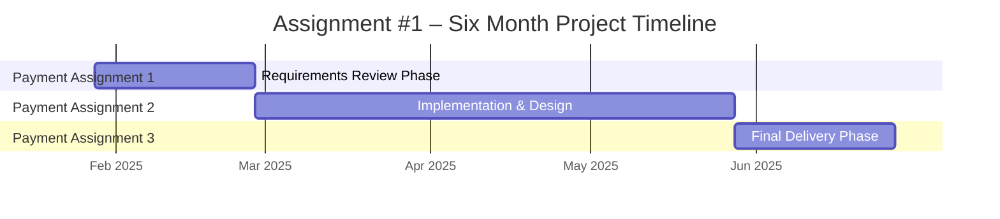

# Assignment #1: Project Management Plan

## Project Overview
This project simulates real-world software project management where I act as a project manager overseeing a development team that is not my own. The goal is to plan, coordinate, and deliver a software product over six months, ensuring that three major payment assignments are completed and approved before payment can be made.

---

## Project Scope & Timeline
The project runs for six months from the starting date and is divided into three major payment assignments that must be completed and approved before payment can be issued:

- **Requirements Review** – Due one month from start date
- **Implementation & Design Review** – Due four months from start date  
- **Final Delivery** – Due six months from start date

Each assignment requires specific inputs and deliverables before progressing to the next phase.

---

## Skills Assessment
I have identified the following team members and their available skills and competencies:

- **Frontend Developer**: Specializes in user interface implementation, responsive design, and client-side functionality
- **Backend Developer**: Experienced in server-side logic, database architecture, and API development
- **QA Analyst**: Skilled in testing methodologies, bug tracking, and quality assurance processes
- **Technical Writer**: Proficient in documentation, user guides, and technical specification writing

Skills were assessed through direct discussion to ensure appropriate task assignment and project risk minimization.

---

## Requirements Review
**Purpose**: Go through all software requirements and verify that the team has defined all that is needed to design software to solve the problem.

**Input**: Requirements Document

**Key Activities**:
- Review complete requirements document for clarity and completeness
- Identify any ambiguous or missing requirements
- Confirm technical feasibility of all requirements
- Document approval from stakeholders before proceeding
- Ensure requirements align with business objectives and user needs

---

## Project Plan
Project tasks are managed using GitHub Projects to simulate real-world project management workflow. Tasks are organized into **Backlog, To Do, In Progress, Review, and Done** columns. Responsibilities are assigned based on team member skills, and progress is monitored throughout the project lifecycle.

### GitHub Projects Task Assignment
- **Backlog**
  - Define initial project timeline (Project Manager) – Due 2025-01-30
  - Create skills assessment document (Project Manager) – Due 2025-01-31
- **To Do**
  - Requirements document analysis (QA Analyst) – Due 2025-02-05
  - Initial system architecture design (Backend Developer) – Due 2025-02-10
- **In Progress**
  - Requirements review and validation (Technical Writer) – Due 2025-02-28
- **Review**
  - Prototype design evaluation (Frontend Developer) – Due 2025-04-30
  - Initial software release testing (QA Analyst) – Due 2025-05-02
- **Done**
  - Final documentation compilation (Technical Writer) – Due 2025-06-20
  - Production software delivery (Project Manager) – Due 2025-06-25

**Workflow Sequence**: Backlog → To Do → In Progress → Review → Done  
**Special Conditions**: One task marked as "In Progress" and one task marked as "Urgent" with detailed descriptions and due dates.

---

## Implementation & Design Review
**Purpose**: Go through the software design and initial release of the software (prototype) and verify the implementation and design meets the requirements and solves the problem.

**Input**: Design Documentation and Initial Software Release

**Key Activities**:
- Review software architecture and design documentation
- Test prototype functionality against requirements
- Validate that design solutions address the core problem
- Identify any design flaws or implementation gaps
- Provide feedback for improvements before final development

---

## Final Delivery
**Purpose**: Deliver the final product to the customer.

**Input**: Final documentation and production release of software

**Key Activities**:
- Complete all development and testing phases
- Prepare final technical and user documentation
- Deploy production-ready software to customer environment
- Conduct final quality assurance and acceptance testing
- Obtain formal customer sign-off and project closure

---

## Project Timeline (Mermaid)

    
    
## Class Time Utilization
A 60-minute class session was conducted on January 28th to discuss requirements and project information with the team. This session was used for:

- Initial requirements clarification and team alignmentSkills assessment and role assignment discussions
- Timeline review and milestone planning
- Communication protocol establishment
- Risk identification and mitigation planning
## Reflection
This project provides valuable experience in managing software development projects with payment-linked milestones. From my perspective:

### Project Quality: 
This is a well-structured project that realistically simulates project management challenges, including timeline pressure, team coordination, and milestone-based delivery.

### User Needs Connection: 
The project strongly connects to user needs through its phased approach, where each payment assignment ensures the product remains aligned with requirements and actually solves the intended problem.

### Difficulty Level: 
The project presents an appropriate level of difficulty – challenging enough to require careful planning and coordination, but not so technical that it becomes inaccessible to project managers. The six-month timeline with three review points creates realistic pressure while allowing sufficient time for quality delivery.

### Overall Assessment: 
This assignment effectively balances theory with practical application, providing experience in both planning and critical evaluation of software projects.