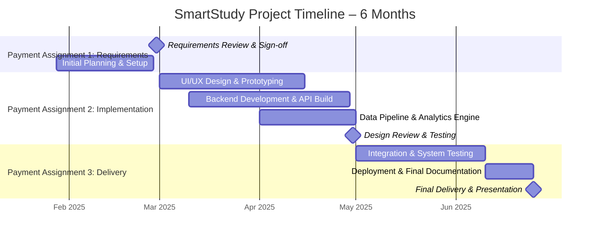

# Assignment #1: Project Management Plan
## Product Manager for "SmartStudy" – Student Learning Analytics Platform

## Project Overview
This project serves as the project management plan for **"SmartStudy"** – a student learning analytics platform being developed by my classmate group for their final term project. As the assigned project manager, I am overseeing a team of four developers: Inshal Zahid, Fabio Bustamante Romillo, Raj Ranabhat, and Hassnain (myself). The platform helps students track study habits, predict exam performance, and provide personalized study recommendations using data analytics.

The project runs for six months with three payment-linked milestones that must be completed and approved before payment can be issued to the development team.

---

## Project Scope & Timeline
**Project Name:** SmartStudy – Learning Analytics Platform  
**Development Team:** Inshal Zahid, Fabio Bustamante Romillo, Raj Ranabhat, Hassnain  
**Project Duration:** 6 months (January 28 – June 25, 2025)  

The project is divided into three major payment assignments:

- **Requirements Review** – Due: February 28, 2025 (Month 1)
- **Implementation & Design Review** – Due: April 30, 2025 (Month 4)  
- **Final Delivery** – Due: June 25, 2025 (Month 6)

Each payment is contingent on successful completion and approval of the corresponding deliverable.

---

## Skills Assessment
I conducted a skills assessment with the four team members:

- **Inshal Zahid** – Frontend & UI/UX Lead  
  *Skills:* React, TypeScript, Figma, Tailwind CSS, responsive design, user research  
  *Role:* Implements dashboard, data visualizations, and user interface design

- **Fabio Bustamante Romillo** – Backend & Database Architect  
  *Skills:* Python (Django/Flask), PostgreSQL, REST APIs, data modeling, system architecture  
  *Role:* Develops analytics engine, database design, and backend API development

- **Raj Ranabhat** – DevOps & Cloud Infrastructure Specialist  
  *Skills:* AWS, Docker, CI/CD pipelines, Linux administration, security, deployment automation  
  *Role:* Manages cloud deployment, containerization, monitoring, and scalability

- **Hassnain** – QA, Documentation & Project Coordination  
  *Skills:* Testing (Selenium, Jest), technical writing, requirements analysis, agile methodologies  
  *Role:* Ensures quality assurance, writes documentation, validates requirements, and supports project tracking

Skills were assessed during a 60-minute class session on January 28th to align roles with project needs.

---

## Requirements Review
**Purpose:** To review all software requirements and verify the team has defined everything needed to design the SmartStudy platform.

**Input:** SmartStudy Requirements Document (provided by the team)

**Key Activities:**
- Review functional requirements: user authentication, study session tracking, analytics dashboard, report generation
- Review non-functional requirements: system performance, scalability, data privacy (FERPA compliance)
- Confirm that all user stories are captured: student users, instructor views, admin panel
- Validate technical feasibility of predictive analytics features
- Identify gaps: missing mobile responsiveness requirements, unclear data export functionality
- Document stakeholder sign-off before proceeding to design phase

---

## Project Plan
Project tasks are managed using **GitHub Projects** with the following workflow:  
**Backlog → To Do → In Progress → Review → Done**

### GitHub Projects Task Board
- **Backlog**
  - Finalize project charter and scope (Hassnain) – Due 2025-01-30
  - Complete skills matrix (Hassnain) – Due 2025-01-31

- **To Do**
  - Analyze requirements document (Hassnain) – Due 2025-02-05
  - Design database schema (Fabio) – Due 2025-02-10
  - Create UI wireframes (Inshal) – Due 2025-02-15
  - Setup initial AWS environment (Raj) – Due 2025-02-20

- **In Progress**
  - Requirements validation and gap analysis (Hassnain) – Due 2025-02-28

- **Review**
  - Evaluate prototype analytics dashboard (Inshal & Fabio) – Due 2025-04-30
  - Test initial study tracking features (Hassnain) – Due 2025-05-02
  - Security and deployment review (Raj) – Due 2025-05-05

- **Done**
  - Compile user manuals and deployment guides (Hassnain) – Due 2025-06-20
  - Deliver final platform to class stakeholders (Hassnain) – Due 2025-06-25

**Task Details:** Each task includes description, assignee, due date, labels (e.g., `urgent`, `frontend`, `backend`), and status.

---

## Implementation & Design Review
**Purpose:** To review the software design and initial release (prototype) of SmartStudy and verify it meets requirements and solves the intended problem.

**Input:** Design Documentation + Initial Software Release (prototype)

**Key Activities:**
- Review architectural diagrams: microservices vs. monolithic approach selected
- Evaluate prototype: test study session logging, dashboard load times, and prediction accuracy
- Validate FERPA compliance in data handling and storage
- Assess usability: conduct internal user testing with classmates
- Confirm integration between frontend (React) and backend (Python/Flask)
- Identify improvements: enhance mobile experience, optimize query performance

---

## Final Delivery
**Purpose:** To deliver the final SmartStudy product to the class (customer) for final presentation and grading.

**Input:** Final documentation + Production release of software

**Key Activities:**
- Deploy final version to AWS Edu instance (Raj)
- Conduct UAT (User Acceptance Testing) with real student users (Hassnain)
- Finalize all documentation: technical specs, API docs, user guide (Hassnain)
- Prepare final presentation for class demonstration (Inshal)
- Archive all project artifacts: code, designs, meeting minutes (Fabio)
- Obtain formal acceptance from instructor and peer review panel (Hassnain)

---

## Project Timeline (Mermaid)

## Class Time Utilization
A structured 60-minute class session was held on January 28th, 2025 with the SmartStudy development team (Inshal, Fabio, Raj, and Hassnain) to:

- Clarify project vision and MVP (Minimum Viable Product) scope

- Discuss technical constraints and platform choices

- Assign roles based on skills assessment

- Establish communication cadence: weekly syncs, Slack for daily updates

- Identify initial risks: data privacy, predictive model accuracy, timeline feasibility

- Agree on GitHub Projects as the primary task management tool

## Reflection
### Project Quality: 
SmartStudy is a relevant and well-scoped academic project that addresses real student needs. The phased payment structure ensures accountability and aligns with agile delivery principles.

### Connection to User Needs: 
Directly connected—students struggle with self-regulated learning, and this platform provides actionable insights. Each phase validates user value: requirements ensure we build the right thing, design review ensures we build it right, and delivery ensures it works in real contexts.

### Difficulty Assessment: 
Moderately challenging. The predictive analytics component adds technical complexity, and FERPA compliance introduces regulatory considerations. The six-month timeline is tight but achievable with clear milestones and team coordination.

### Overall: 
This project effectively blends technical development with project management rigor. It prepares students for real-world scenarios where payment, timelines, and stakeholder alignment are critical to success.